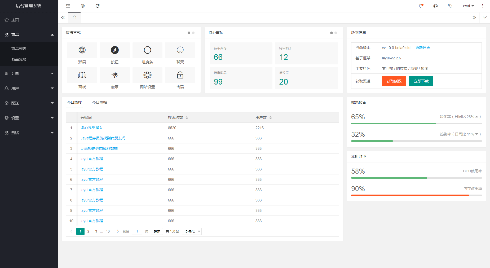
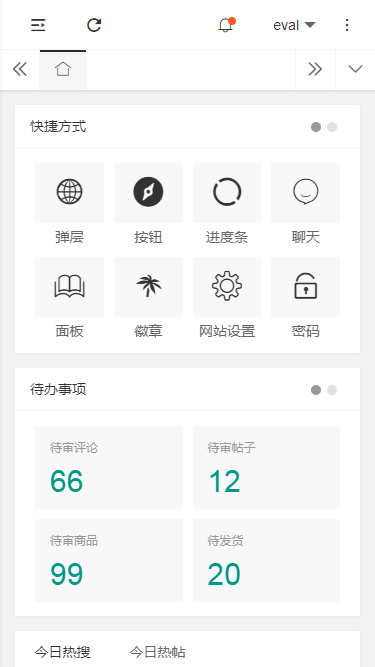
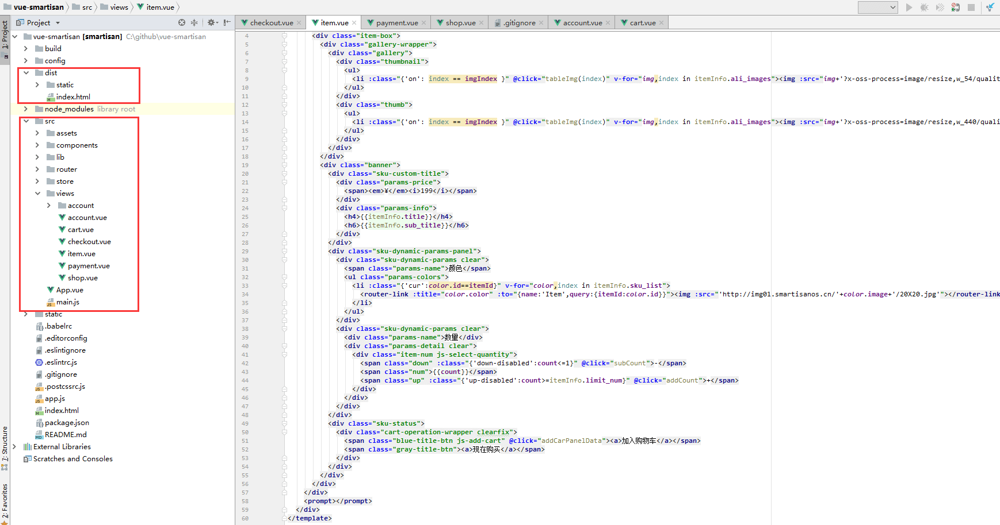
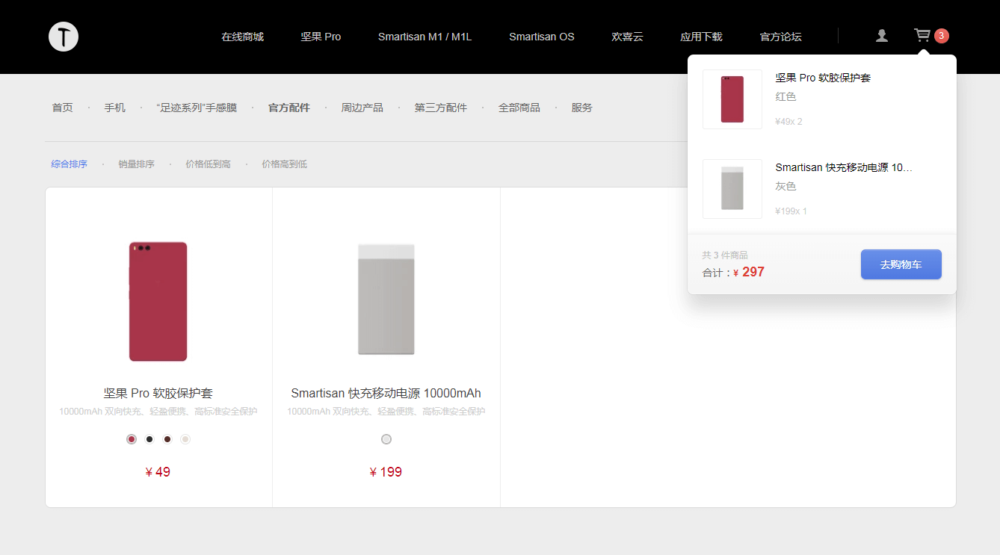

# 前端5-6月份工作规划

## Part.1 工作 & 项目推进规划

* 知识超人二期微信小程序上线；

* PGOT V3.1 教案系统二期上线；

* 班课项目高考提分营二期；

* 教育头条 V4.0 上线；

* 常规市场活动页面；

## Part.2 技术栈持续推进 & 分享

* ECMAScript6 总结和归纳

* Layui响应式后台管理平台

* Vue锤子商城实践

* Svg、Canvas图形化实践

* Nodejs + Mysql后端开发实践

### ECMAScript6 总结和归纳

1.  let和const命令
2.  变量的解构赋值
3.  Set数据结构
4.  Map数据结构
5.  Iterator和for...of循环
6.  class基本使用
7.  Symbol
8.  数组和对象的扩展
9.  函数的扩展
10. Promise
11. Generator
12. async函数

```javascript
//let 在 for 循环中的运用
var btns = document.querySelectorAll('button');

/*for(var i = 0; i < btns.length; i++) {
    ~(function (i) {
        btns[i].onclick = function () {
            console.log(i);
        }
    })(i)
}*/

for(let i = 0; i < btns.length; i++) {
    btns[i].onclick = function () {
        console.log(i);
    }
}
```

### Layui响应式后台管理平台（完美支持响应式）

> Web 最新版本，样式极简，而且对移动端支持非常好，再此感谢Layui带给如此好的体验。



> 完美支持响应式



### 2.3 Vue锤子商城实践（http://dev.smartisan.com/）

> 源代码截图



> 项目截图



### Svg、Canvas图形化实践【后续期待】

1.  函数、勾股定理

2.  苹果菜单实例、三角函数

3.  圆周运动

4.  三维圆周运动

5.  反三角函数

### Nodejs + Mysql后端开发实践【后续期待】

> 后续期待......  

